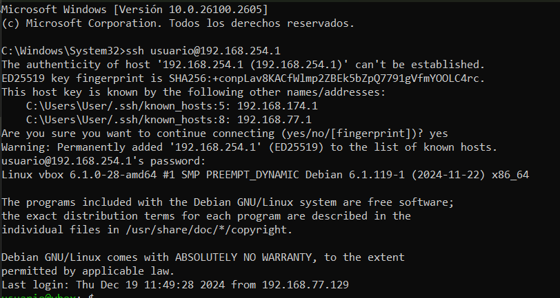
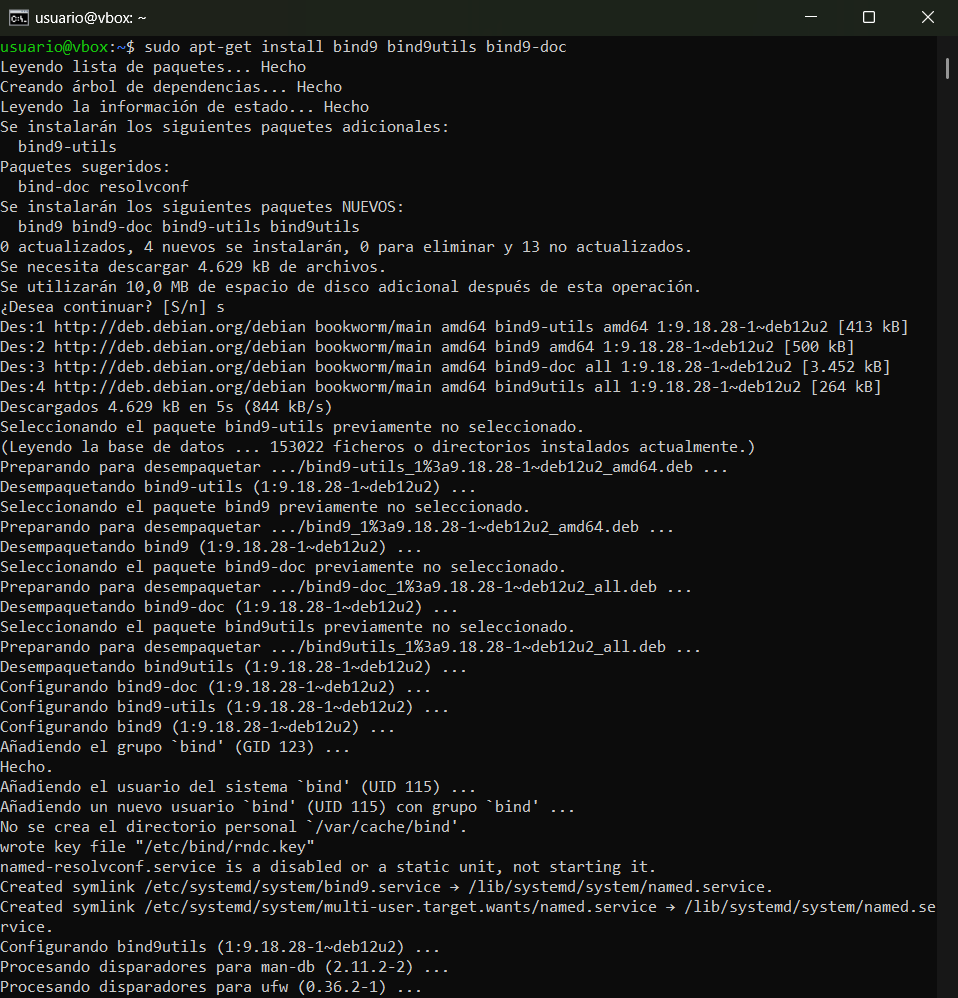
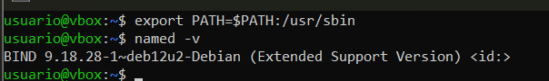
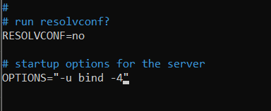
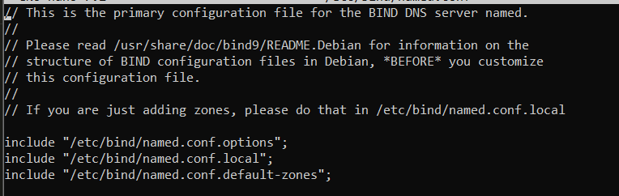

# Práctica 4.1 - Configuración de un servidor DNS

### Conexión mediante SSH
Para esta práctica nos conectaremos mediante ssh a nuestra máquina virtual. Para ello ejecutamos el comando `ssh nuestro_usuario@ip_máquina` en el símbolo de sistema de nuestro ordenador.



### Preparación del entorno
Es muy importante, que antes de empezar, eliminemos las entradas del archivo `/etc/hosts` para que las pruebas de resolución se realicen exclusivamente a través del servidor DNS.


#### Istalación de Bind9
Primero que nada actualizamos nuestro sistema con el comando `sudo apt-get update` y cuando termine la actualización instalamos bind9, el cual es el estándar de facto para servidores DNS. Esto lo haremos con el comando:

```console
sudo apt-get install bind9 bind9utils bind9-doc
```

La versión 9 es la recomendada para usarse y la que vamos a utilizar ya que garantiza la interoperabilidad con otros sistemas DNS, haciendo que sea una opción robusta y completa para la mayoría de casos de uso relacionados con servidores DNS.



Ejecutamos el comando `named -v` para ver si está instalado correctamente. En mi caso no salía asique tuve que agregarlo a mi PATH.

Agregamos `/usr/sbin` a nuestro PATH temporalmente con el comando `export PATH=$PATH:/usr/sbin` y posteriormente ejecutamos el comando `named -v` otra vez y debería aparecer la versión que tenemos.



### Configuración del servidor

Editaremos el archivo general de Bind para indicarle que sólo use IPv4. Este archivo se encuentra en `/etc/default` y para abrirlo simplemente hay que ejecutar el comando `sudo nano /etc/default/named`. 

Ya solo nos queda cambiar la línea `OPTIONS="-u bind"` por el texto:

```
OPTIONS = "-u bind -4"
```



Tras esto tendremos que guardar los cambios con `CTRL + X` y luego reiniciar el servicio con `sudo systemctl restart bind9` para comprobar que la configuración ha sido correctamente editada.


Ejecutamos el comando `sudo nano /etc/bind/named.conf` para saber las referencias a los 3 archivos donde deberemos hacer la configuración, ubicados en el mismo directorio



### Configuración de los archivos
#### *named.conf.options*
#### *named.conf.local*
#### *named.conf.default-zones*