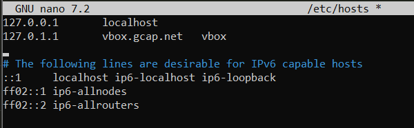
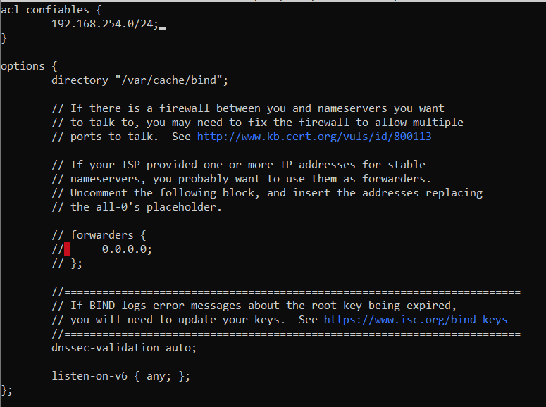
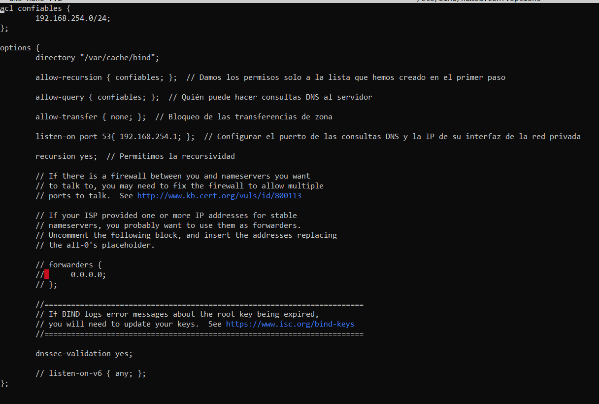
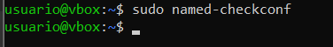
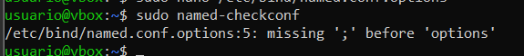
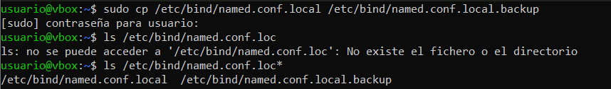
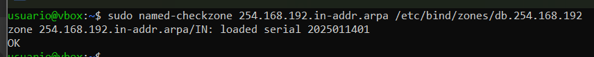
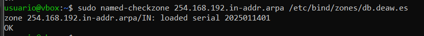

# Práctica 4.1 - Configuración de un servidor DNS

## Conexión mediante SSH
Para esta práctica nos conectaremos mediante ssh a nuestra máquina virtual. Para ello ejecutamos el comando `ssh nuestro_usuario@ip_máquina` en el símbolo de sistema de nuestro ordenador.


## Preparación del entorno
Es muy importante, que antes de empezar, eliminemos las entradas del archivo `/etc/hosts` para que las pruebas de resolución se realicen exclusivamente a través del servidor DNS.



### Istalación de Bind9
Primero que nada actualizamos nuestro sistema con el comando `sudo apt-get update` y cuando termine la actualización instalamos bind9, el cual es el estándar de facto para servidores DNS. Esto lo haremos con el comando:

```console
sudo apt-get install bind9 bind9utils bind9-doc
```

La versión 9 es la recomendada para usarse y la que vamos a utilizar ya que garantiza la interoperabilidad con otros sistemas DNS, haciendo que sea una opción robusta y completa para la mayoría de casos de uso relacionados con servidores DNS.


Ejecutamos el comando `named -v` para ver si está instalado correctamente. En mi caso no salía asique tuve que agregarlo a mi PATH.

Agregamos `/usr/sbin` a nuestro PATH temporalmente con el comando `export PATH=$PATH:/usr/sbin` y posteriormente ejecutamos el comando `named -v` otra vez y debería aparecer la versión que tenemos.


### Configuración del servidor

Editaremos el archivo general de Bind para indicarle que sólo use IPv4. Este archivo se encuentra en `/etc/default` y para abrirlo simplemente hay que ejecutar el comando `sudo nano /etc/default/named`. 

Ya solo nos queda cambiar la línea `OPTIONS="-u bind"` por el texto:

```
OPTIONS = "-u bind -4"
```


Tras esto tendremos que guardar los cambios con `CTRL + X` y luego reiniciar el servicio con `sudo systemctl restart bind9` para comprobar que la configuración ha sido correctamente editada.


Ejecutamos el comando `sudo nano /etc/bind/named.conf` para saber las referencias a los archivos donde deberemos hacer la configuración, ubicados en el mismo directorio.


### Configuración de los archivos
Hacer una copia de seguridad de los archivos de configuración cada vez que se va a realizar un cambio es una buena práctica, para así, si causa algun tipo de error siempre se puede volver a la versión anterior.

#### *named.conf.options*


Con este comando lo que estamos haciendo es guardar una copia en del archivo `/etc/bind/named.conf.options` y de esta manera tener la posibilidad de volver a la configuración inicial.

Ahora viene el momento de proceder a editar el archivo `/etc/bind/named.conf.options`. Para ello abrimos el archivo con nano y haremos varios cambios en el documento.

##### Lista de IPs.

Primero, añadimos justo antes del bloque `options {...}` el siguiente bloque de código:

```
acl confiables {
    192.168.X.0/24;
}
```

En la dirección IP cambiaremos la `X` por el valor de nuestra red local. En mi caso sería `192.168.254.0`.




Aquí lo que estamos haciendo es crear un bloque donde iremos poniendo las distintas IP que pueden hacer consultas desde nuestra red.

##### Habilitamos la recursión

Después, permitimos unicamente las consultas recursivas a los host que hemos decidido en el paso anterior. Para ello tenemos que editar la parte `options {...}` y añadir la siguiente línea:

```
options {
    directory "/var/cache/bind";

    allow-recursion { confiables; };
}
```


De esta forma configuramos que solo pueda realizar consultas recursivas aquellas IP que se encuentren en la lista `confiables` que hemos creado anteriormente.

##### Restricciones para las consultas DNS

Posteriormente definimos quién puede realizar consultas DNS al servidor, dando permiso sólo a las direcciones que hay en la lista `confiables`. Para ello añadimos
`allow-query { confiables; };` al bloque de código `options {...}`.


##### Transferencia de zonas

En este apartado lo que haremos será añadir una línea más a nuestro bloque `options {...}` como venimios haciendo hasta ahora. En este caso será la línea `allow-transfer { none; };`. Lo que hacemos con esto es impider las transferencias de zona, las cuales son copias completas de las bases de datos DNS.

Básicamente lo que estamos es añadir una medida de seguridad para que otros servidores no puedan obtener información sobre las zonas configuradas en el servidor.


##### Configuración del servidor

Configuramos el servidor para que escuche consultas DNS en el puerto 53 y en la IP de su interfaz de la red privada colocando la IP de la interfaz de nuestra máquina Debian.

Para ello simplemente hay que añadir la línea `listen-on port 53{ 192.168.254.1; };` en la siguiente línea.


##### Habilitación de la recursión

Ahora habilitaremos la recursividad para que el servidor DNS pueda realizar consultas recursivas. Para ello simplemente añadimos la línea `recursion yes;` en la siguiente línea. Esto lo que va a hacer es hacer que el servidor pueda buscar respuestas en otros servidores DNS si no obtiene la respuesta localmente.


##### Configuración total

Finalmente, con los cambios realizados, el archivo `/etc/bind/named.conf.options` quedaría de esta manera:



>ℹ️Info
>
> Con la línea `dnssec-validation yes;` lo que estamos haciendo es habilitar activar la validación de las respuestas DNS usando DNSSEC.
> 
> De esta forma garantizamos la seguridad e integridad del sistema DNS y lo protegemos contra ataques como **DNS spoofing** o **cache poisoning**, los cuales son ataques que compromenten el sistema DNS redirigiendo el tráfico de usuarios hacia otros sitios maliciosos aunque el dominio solicitado parezca legítimo.

##### Comprobación

Finalmente para comprobar que el archivo está correctamente configurado simplemente hay que ejecutar el comando:  

```
sudo named-checkconf
```



Si todo está correcto, no mostrará ningún mensaje de error y tenemos que proceder a reiniciar el servicio con el comando `sudo systemctl restart bind9`.


En el caso de que al ejecutar el comando `sudo named-checkconf` nos de algun error, simplemente tenemos que ir a la línea que nos dice y colocar los datos que te proporciona al lanzar dicho error. Por ejemplo, si te ha faltado un `;` te pondrá algo tal que:



Aquí lo que te está diciendo el error es que falta un `;` al final del primer bloque que hemos creado, justo antes de `options {...}`.

#### *named.conf.local*

Este caso solo necesitaremos añadir un par de líneas indicando que el servidor DNS es maestro en esta zona y le indicaremos dónde estará ubicado el archivo de zona que crearemos.

Para ello primero tenemos que guardar la configuración por defecto como hicimos con el archivo anterior, para tener una opción de poder volver a la configuración inicial. Simplemente tenemos que ejecutar el comando `sudo cp /etc/bind/named.conf.local /etc/bind/named.conf.local.backup` y ya estaría hecha la copia de seguridad y podemos proceder a cambiar la configuración de dicho archivo.



Después de haber hecho la copia de seguridad tenemos que añadir el siguiente bloque de texto:

```
zone "deaw.es" {
    type master;
    file "/etc/bind/zones/db.deaw.es";   // Ruta donde ubicaremos nuestro archivo de zona
};
```


##### Creación del archivo de zona

Ahora procedemos a configurar el archivo de zona de resolución directa justo en el directorio que hemos indicado antes y con el mismo nombre que hemos indicado en el archivo de configuración local.

Para ello primero tenemos que crear el archivo `/etc/bind/zones/db.deaw.es` que es en el que añdiremos la siguiente información:

```
$TTL    604800
@       IN      SOA     debian.deaw.es. admin.deaw.es. (
                ; Cualquier valor numérico es OK para el serial
                ; pero recomendado: [AñoMesDiaVersion]
                2025011401  ;Serial
                3600        ;Refresh
                1800        ;Retry
                604800      ;Expire
                86400       ;Minimum TTL
        )

        ;Definimos el servidor de nombres
        IN NS debian.deaw.es.

;Definimos la IP del servidor de nombres
debian IN A 192.168.254.1
```

En este archivo lo que estamos haciendo es establecer un tiempo de vida de 7 días para los registros de la zona. Esto quiere decir que durante ese periodo de tiempo, los registros serán almacenados en caché por otros servidores.

En el apartado `@ IN SOA debian.deaw.es admin.deaw.es` lo que hacemos es declarar el nombre del servidor principal que administra esta zona y indicarle el correo del administrador del servidor (en servidores DNS, el `.` remplaza al `@`).

Los parámetros que le pasamos al `SOA` son:

- `2025011401`: Número de serie, usando la fecha de hoy (14/01/2025) en formato AñoMesDia y también añadimos la version que en este caso sería la 01.
- `3600`: Intervalo de tiempo que los servidores secundarios es:peran antes de pedir actualizaciones
- `1800`: tiempo para reintentar después de un fallo.
- `604800`: Tiempo tras el cual, los secundarios dejan de usar la zona si no reciben actualizaciones.
- `86400`: Tiempo mínimo de caché para los registros negativos (cuando no se encuentra un dominio).

En el apartado `IN NS debian.deaw.es.` definimos el servidor de nombres para la zona indicada.

Con `debian IN A 192.168.254.1` lo que queremos es asociar el nombre `debian` al registro A, con la dirección IP `192.168.254.1`.

En resumen, este archivo lo que hace es configurar el dominio deaw.es, gestionado por el servidor `debian.deaw.es.` con la IP de mi servidor local. Los parámetros del SOA definen como interactúan los servidores primarios y secundarios.


##### Creación del archivo de zona para la resolución inversa

Ahora procedemos a configurar la zona inversa. Para ello primero tenemos que editar el archivo `named.conf.local` y añadir el bloque de la zona inversa:

```
zone "254.168.192.in-addr.arpa" {
    type master;
    file "/etc/bind/zones/db.254.168.192";  // Ruta donde ubicaremos nuestro archivo de zona
};
```


Luego, también debemos crear y editar el archivo `/etc/bind/zones/db.254.168.192` en el que pondremos algo similar al archivo del paso anterior.

```
$TTL    604800
@       IN      SOA     debian.deaw.es. admin.deaw.es. (
                ; Cualquier valor numérico es OK para el serial
                ; pero recomendado: [AñoMesDiaVersion]
                2025011401  ;Serial
                3600        ;Refresh
                1800        ;Retry
                604800      ;Expire
                86400       ;Minimum TTL
        )

        ;Definimos el servidor de nombres
        IN NS debian.deaw.es.

; Registros PTR
1 IN PTR debian.deaw.es.
```

Este bloque es similar al anterior con el cambio de que se configura el registro PTR para la dirección IP `192.168.254.1`, que se resuelve al nombre `debian.deaw.es.`.


Para comprobar si la configuración que hemos hecho está hecha correctamente simplemente tenemos que ejcutar los siguientes comandos:

```
sudo named-checkzone 254.168.192.in-addr.arpa /etc/bind/zones/db.254.168.192

sudo named-checkzone 254.168.192.in-addr.arpa /etc/bind/zones/db.deaw.es
```

Si todo está correctamente configurado tenemos que ver un mensaje como los siguientes:





Si todo está correctamente configurado, procedemos a reiniciar el servicio y a comprobar el estado con el mismo comando que en los primeros pasos `sudo systemctl restart named` y `sudo systemctl status named`.


### Comprobación de las resoluciones y las consultas

Con el comando `dig debian.deaw.es` y `dig -x 192.168.254.1` podemos comprobar las resoluciones directas e inversas que hemos configurado anteriormente.


## Cuestiones finales

>✏️Cuestión 1
>
>¿Qué pasará si un cliente de una red diferente a la tuya intenta hacer uso de tu DNS de alguna manera, le funcionará?¿Por qué, en qué parte de la configuración puede verse?

Como ya se ha respondido durante la documentación, no le funcionaría ya que en la configuración del servidor DNS hemos especificado una lista de acceso (ACL) en el archivo `/etc/bind/named.conf.options`. En ese archivo se ha especificado que sólo los clientes de la red `192.168.254.0/24` están autorizados a hacer consultas recursivas indicandose así en las directivas `allow-recursion` y `allow-query`.

>✏️Cuestión 2
>
>¿Por qué tenemos que permitir las consultas recursivas en la configuración?

Al permitir las consultas recursivas, lo que estamos haciendo es que el servidor DNS no solo resuelva nombres dentro de sus zonas configuradas, si no que también pueda buscar la información en otros servidores DNS si el nombre no está disponible directamente. Esto es importante para permitir que los clientes puedan acceder a cualquier dominio en Internet que no esté directamente configurado en tu servicio DNS. En resumen, sin consultas recursivas, el servidor solo podrá responder por los dominios de su propia zona autoritativa.

>✏️Cuestión 3
>
>El servidor DNS que acabáis de montar, ¿es autoritativo?¿Por qué?

Sí, ya que lo hemos configurado como servidor maestro para esa zona y es responsable de proporcionar respuestas definitivas para los dominios dentro de la zona especificada.

>✏️Cuestión 4
>
>¿Dónde podemos encontrar la directiva $ORIGIN y para qué sirve?

La podemos encontrar dentro de los archivos de zona, como por ejemplo en el archivo `/etc/bid/zones/db.deaw.es`. Sirve para definir el dominio base para los registros DNS dentro de ese archivo. Es útil para evitar la repetición del nombre de dominio completo en cada registro. 

>✏️Cuestión 5
>
>¿Una zona es idéntico a un dominio?

Una zona y un dominio no son lo mismo pero están relacionados entre sí.
* Una zona es una porción de la jerarquía de nombres de dominio que es administrada por un servidor DNS
* Un dominio es un nombre único en la jerarquía de DNS, pero no necesariamente se corresponde con una zona completa.

>✏️Cuestión 6
>
>¿Pueden editarse los archivos de zona de un servidor esclavo/secundario?

No deben ser editados manualmente. Si se necesitan hacer cambios en los registros de la zona, se debe hacer en el servidor maestros y luego los esclavos recibirán la actualización automáticamente.

>✏️Cuestión 7
>
>¿Por qué podría querer tener más de un servidor esclavo para una misma zona?

Porque si un servidor esclavo falla o se desconecta, otros pueden seguir respondiendo a las consultas DNS. Esto es especialmente importante para garantizar que el servicio DNS siempre esté disponible y no dependa de un solo servidor, de esta forma mejorar la resiliencia y la disponibilidad del servicio.

>✏️Cuestión 8
>
>¿Cuántos servidores raíz existen?

Existen 13 servidores raíz en todo el mundo. Estos servidores son responsables de dirigir las consultas de DNS hacia los servidores de nombres autoritativos adecuados para resolver los dominios.

Estos servidores son:

| Letra | Operador                         | Dirección IPv4    |
|-------|----------------------------------|-------------------|
| A     | Verisign                        | 198.41.0.4       |
| B     | USC-ISI                         | 192.228.79.201   |
| C     | Cogent Communications           | 192.33.4.12      |
| D     | Universidad de Maryland         | 199.7.91.139     |
| E     | NASA                            | 192.203.230.10   |
| F     | Internet Systems Consortium     | 192.5.5.241      |
| G     | Defense Information Systems     | 192.112.36.4     |
| H     | U.S. Army Research Lab          | 128.63.2.53      |
| I     | Netnod                          | 192.36.148.17    |
| J     | Verisign                        | 192.58.128.30    |
| K     | RIPE NCC                        | 193.0.14.129     |
| L     | ICANN                           | 199.7.83.42      |
| M     | Proyecto WIDE                   | 202.12.27.33     |

>✏️Cuestión 9
>
>¿Qué es una consulta iterativa de referencia?

Una consulta iterativa de referencia es cuando un servidor DNS no resuelve completamente una consulta, sino que devuelve una referencia a otro servidor que puede ser capaz de hacerelo. El cliente debe seguir consultando a esos servidores de referencia hasta obtener una respuesta definitiva. 

>✏️Cuestión 10
>
>En una resolución inversa, ¿a qué nombre se mapearía la dirección IP 172.16.34.56?

En una resolución inversa, la dirección IP `172.16.34.56` se convertiría en un nombre de dominio siguiendo la estructura de una zona de resolución inversa. El resultado final se expresaría como:

```
56.34.16.172.in-addr.arpa
``` 

---------------
Autor: Jorge Pradillo Hinterberger